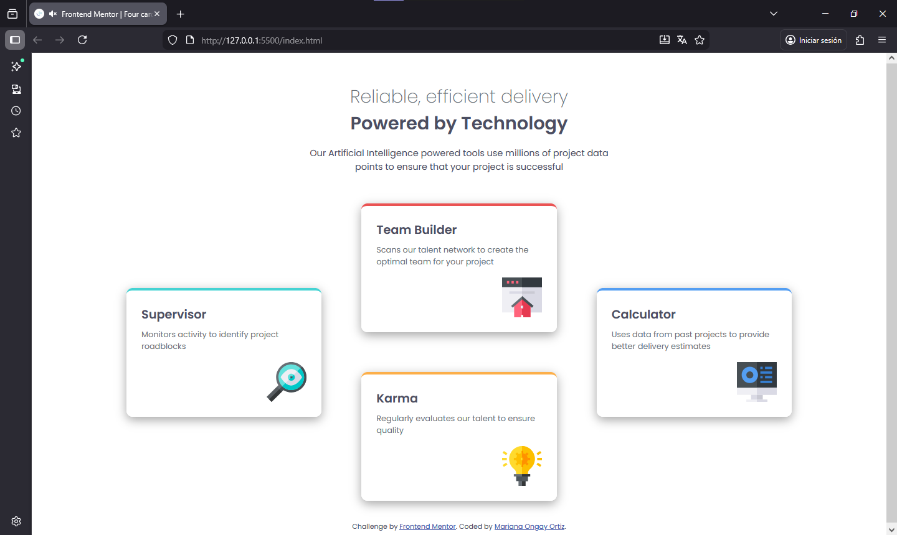
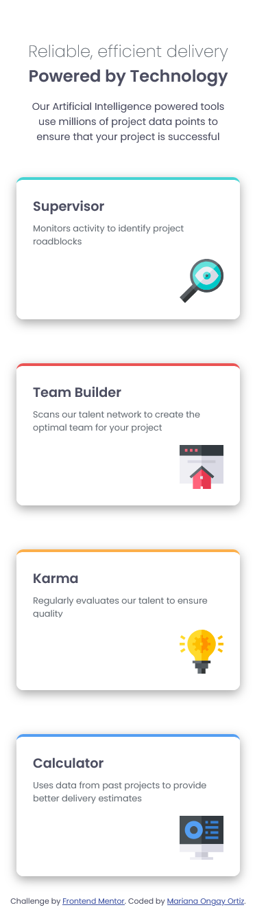

# Frontend Mentor - Four card feature section solution

Solución de [Four card feature section challenge on Frontend Mentor](https://www.frontendmentor.io/challenges/four-card-feature-section-weK1eFYK).

### Screenshot
Diseño finalizado

Diseño movil

### Comandos

    npm install

    npm install -g sass

    sass scss/styles.scss css/styles.css

    sass --watch scss:css

## Author

- Website - Mariana Ongay Ortiz
- Frontend Mentor - [@MarianaOngay17](https://www.frontendmentor.io/profile/MarianaOngay17)
